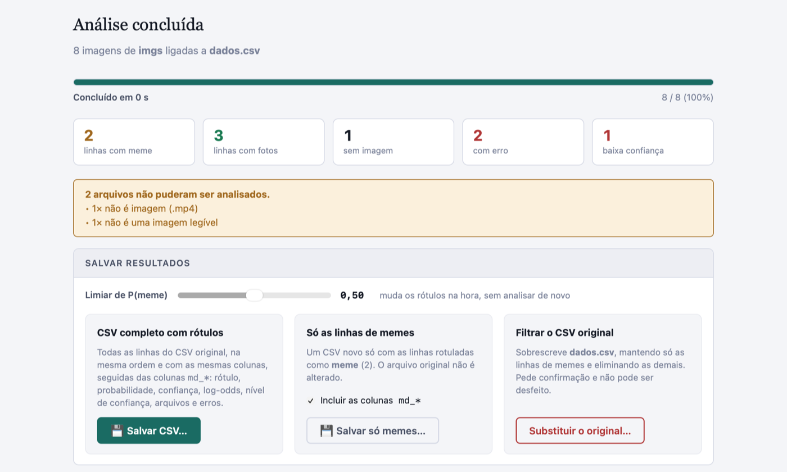

# MemeDetection

App para macOS que **classifica como meme ou foto as imagens ligadas às linhas de um CSV**. Você indica a planilha e a pasta de imagens, o app analisa cada imagem neste Mac e devolve o CSV com um rótulo e colunas de métricas de confiança. Também dá para gerar um CSV **só com as linhas de memes**. Nada sai do seu computador.

A classificação usa o modelo **[meme-detection](https://github.com/maty-bohacek/meme-detection)** de Matyáš Boháček, incluído neste repositório, rodando no Core ML do próprio macOS.

**[▶ Página do app e download](https://memedetection.colab.meme/)**



---

## O que faz

- Recebe um **CSV** e uma **pasta de imagens**, escolhidos numa janela do sistema ou arrastados do Finder. Subpastas são incluídas.
- **Liga cada linha às suas imagens** automaticamente, de dois jeitos:
  - **pelo nome do arquivo**: uma coluna com `1234.jpg`, `imagens/1234.jpg` ou vários nomes separados por `|`, como a coluna `wgetlab_arquivo` do manifesto do [WgetLAB](https://wgetlab.colab.meme/);
  - **pelo ID**: arquivos `<id>.jpg`, `<id>_1.jpg`, `<id>_2.png`…, no padrão de nomes do WgetLAB. O número da linha também serve de ID.
- Classifica cada imagem com o modelo original. Formatos: JPG, PNG, GIF (primeiro quadro), WebP, HEIC, BMP e TIFF.
- Uma linha com várias imagens recebe **meme se pelo menos uma delas for meme**.
- Acrescenta ao CSV as colunas `md_*`, **sem alterar as colunas originais**: ordem, delimitador (`,` `;` tab), aspas, quebras de linha e BOM são preservados.
- Salva, sempre como cópia (o CSV e a pasta originais nunca são alterados):
  - **Cópia do CSV com Rótulos**: todas as linhas, com as colunas `md_*`;
  - **Cópia do CSV Filtrada (Somente Memes)**: só as linhas de memes, com ou sem as colunas `md_*`;
  - **Cópia da Pasta de Imagens (Somente Memes)**: uma pasta nova, onde você indicar, com uma cópia das imagens classificadas como meme, mantendo as subpastas. Se 3.318 de 5.000 imagens forem memes, a pasta nova recebe só essas 3.318, e a pasta original continua com as 5.000;
  - **Amostra do CSV e da Pasta de Imagens**: uma calculadora de tamanho de amostra (veja abaixo) sorteia linhas de memes e cria uma pasta nova com o CSV da amostra, as imagens de memes dessas linhas e os parâmetros do sorteio.
- Em **cada exportação** você escolhe a **confiança**: todas as linhas classificadas (alta, média e baixa), só alta e média, ou **só alta**. Com filtro, linhas sem imagem ou com erro ficam de fora. Na cópia de imagens, vale o nível de cada imagem. O cartão mostra na hora quantas linhas ou imagens vão ser exportadas.
- **Avaliação opcional:** se uma coluna já tem rótulos codificados à mão, o app calcula **acurácia, precisão, recall, F1** e a matriz de confusão, e exporta um relatório.
- Tem **limiar ajustável**: mudar o limiar recalcula os rótulos na hora, sem analisar de novo.
- Mostra o **comando equivalente no Terminal**, que dá o mesmo resultado para scripts e bases grandes.

## Amostra

O cartão **Amostra do CSV e da Pasta de Imagens** funciona como as calculadoras de tamanho de amostra usuais, por exemplo a da SurveyMonkey. Você informa:
- o **tamanho da população**, preenchido com o número de linhas de memes disponíveis;
- o **nível de confiança**: 80, 85, 90, 95 ou 99%;
- a **margem de erro**.

O app calcula o tamanho da amostra pela fórmula de Cochran com correção para população finita e proporção esperada de 50%:

n₀ = z² · p(1 − p) / e²  e  n = n₀ / (1 + (n₀ − 1) / N)

Exemplos, com 95% de confiança e 5% de margem: 5.000 → **357**, 3.318 → **345**, 1 milhão → **385**.

As linhas são sorteadas ao acaso, sem reposição, entre as linhas rotuladas como **meme**, respeitando o filtro de confiança escolhido. Com a mesma **semente**, o sorteio se repete. O app cria uma pasta nova com:

| Arquivo | Conteúdo |
|---|---|
| `<csv>_amostra.csv` | Só as linhas sorteadas, na ordem original, com ou sem as colunas `md_*` |
| `<pasta de imagens>/` | Cópia das imagens de memes dessas linhas, mantendo as subpastas |
| `amostra_parametros.csv` | População, nível de confiança, margem de erro, tamanho calculado e sorteado, semente, limiar, filtro de confiança e os números das linhas sorteadas, para documentar e reproduzir a amostra |

## Colunas acrescentadas

| Coluna | Conteúdo |
|---|---|
| `md_rotulo` | `meme`, `foto`, `sem_imagem` (nenhuma imagem ligada à linha) ou `erro` (nenhuma imagem pôde ser lida) |
| `md_prob_meme` | Probabilidade de meme, de 0 a 1, dada pelo modelo. Com várias imagens, vale a mais "meme" |
| `md_confianca` | Probabilidade da classe escolhida: `md_prob_meme` para memes, `1 − md_prob_meme` para fotos |
| `md_logit` | Log-odds de meme, `ln(p / (1 − p))`. Positivo = meme, negativo = foto. Como as probabilidades do modelo saturam (0,9999…), o log-odds é a medida mais útil para comparar imagens |
| `md_nivel_confianca` | `alta`, `média` ou `baixa`, pela distância entre o log-odds e o limiar: ≥ 8 é alta, de 3 a 8 é média e < 3 é baixa. Vale a pena revisar à mão as linhas de confiança **baixa** |
| `md_n_imagens` · `md_n_memes` | Quantas imagens estão ligadas à linha e quantas delas são memes |
| `md_arquivos` | Arquivos analisados, separados por ` \| ` |
| `md_erro` | Arquivos que não puderam ser lidos e o motivo, por exemplo `não é imagem (.mp4)` |
| `md_acuracia_validacao_modelo` | `0.91`, a acurácia de validação declarada pelo autor do modelo, para referência |

Rótulos verdadeiros aceitos na avaliação: `meme`, `1`, `sim`, `true`… para meme; `foto`, `photo`, `0`, `não`, `false`… para foto.

---

## Instalar

1. Baixe `MemeDetection-macOS.zip` na [página de releases](https://github.com/ombudsmanviktor/memedetection/releases/latest) e descompacte.
2. Arraste o **MemeDetection.app** para a pasta Aplicativos.
3. Na primeira vez, clique no app com o **botão direito → Abrir** e confirme. O app não é notarizado pela Apple, então o macOS avisa. Se aparecer "o app está danificado", rode no Terminal:

```bash
xattr -dr com.apple.quarantine /Applications/MemeDetection.app
```

Requisitos: macOS 12 ou mais recente, Apple Silicon ou Intel.

## Usar pelo Terminal

O mesmo executável funciona como ferramenta de linha de comando, com a mesma lógica e o mesmo CSV de saída do app:

```bash
/Applications/MemeDetection.app/Contents/MacOS/MemeDetection \
  --csv ~/pesquisa/posts.csv --images ~/pesquisa/imagens \
  --column id --only-memes --out ~/pesquisa/posts_memes.csv
```

| Opção | |
|---|---|
| `--csv`, `--images` | CSV e pasta de imagens (obrigatórios) |
| `--column COL` | Coluna que liga a linha à imagem (`#linha` = número da linha). Padrão: detectada automaticamente |
| `--mode file\|id\|auto` | Se a coluna tem nomes de arquivo ou IDs (padrão `auto`) |
| `--threshold X` | Limiar de P(meme), padrão `0.5` |
| `--only-memes` · `--no-metrics` | Gravar só as linhas de memes e/ou omitir as colunas `md_*` |
| `--truth COL` | Coluna com o rótulo verdadeiro: imprime a acurácia e grava `<saída>_avaliacao.csv` |
| `--out ARQ` | CSV de saída. Pode ser o próprio `--csv`, para filtrar o original |
| `--min-confidence N` | `alta`, `media` (alta e média) ou `baixa` (todas, padrão). Vale para o CSV gravado e para `--copy-memes` |
| `--sample-out PASTA` | Cria a pasta de amostra descrita acima. Ajuste com `--sample-confidence 80\|85\|90\|95\|99` (padrão 95), `--sample-margin X` (%, padrão 5), `--sample-population N`, `--sample-size N` (tamanho fixo, sem calculadora) e `--seed S` |
| `--copy-memes PASTA` | Cria `PASTA` com uma cópia só das imagens classificadas como meme, mantendo as subpastas. A pasta precisa ser nova (ou vazia) e ficar fora da pasta de imagens |
| `--concurrency N` | Imagens em paralelo (1–8, padrão 4) |

---

## Sobre o modelo

O `.mlmodel` do HEAD do repositório original **não é o detector de memes**: é um classificador de sentimento de texto, enviado por engano. O modelo de imagens correto está no commit `de6affb`, e é esse que vai incluído aqui. Ele é um pipeline Create ML formado pelo extrator `VisionFeaturePrint_Scene` da Apple, que vem embutido no macOS, e por uma regressão logística. Por depender do extrator da Apple, o modelo **só roda no Core ML de um Mac ou iPhone**, e não num navegador. Detalhes, verificação do arquivo e notas de reprodutibilidade estão em [Resources/model/README.md](Resources/model/README.md).

**Limites.** O autor declara 91% de acurácia de validação, com um conjunto de treino de alguns milhares de imagens de 2020. O modelo distingue bem fotos de *image macros* com texto sobreposto, mas pode errar com prints de tela, cartazes, charges ou memes sem texto. Use a avaliação com uma amostra codificada à mão para medir o desempenho na sua base. Os valores podem variar um pouco entre Macs (Apple Silicon × Intel). No mesmo Mac, os resultados se repetem.

## Privacidade

O CSV e as imagens são lidos direto do disco e analisados localmente. O app não faz nenhuma conexão de rede: não há servidor, telemetria nem cookies. Os arquivos só são gravados onde você escolher. Pela interface, o CSV e a pasta originais nunca são alterados: todas as exportações gravam **cópias**. Só pelo Terminal, com `--out` apontando para o próprio `--csv`, o original é substituído. Em discos APFS, o padrão dos Macs, a cópia é um clone instantâneo, que não ocupa espaço extra enquanto os arquivos não forem modificados.

---

## Compilar a partir do código

Basta ter os Command Line Tools da Apple (`xcode-select --install`). Não é preciso Xcode.

```bash
scripts/build-app.sh            # universal (arm64 + x86_64) → dist/MemeDetection.app e dist/MemeDetection-macOS.zip
scripts/build-app.sh --debug --arm64-only
```

O script detecta um defeito de algumas versões dos Command Line Tools no macOS 26, que trazem o módulo `SwiftBridging` definido em dois arquivos, e o contorna com um overlay VFS, sem alterar o sistema.

| Pasta | Conteúdo |
|---|---|
| `Sources/MemeDetection/` | App em Swift: janela WKWebView, ponte JS↔Swift, classificador Core ML, leitura dos pesos do GLM, modo CLI |
| `Resources/ui/` | Interface (HTML/CSS/JS). `core.js` concentra a ligação linha↔imagem, os rótulos e a geração do CSV, e é usado pela interface e pelo CLI (via JavaScriptCore) |
| `Resources/ui/vendor/` | PapaParse 5.4.1 (MIT), incluído no repositório: o app não usa CDN |
| `Resources/model/` | O modelo original e sua documentação |
| `docs/` | Site do GitHub Pages (`memedetection.colab.meme`) |

Para testar só a interface no navegador, com classificação simulada:

```bash
python3 -m http.server 8090
```

Depois abra `http://localhost:8090/Resources/ui/index.html?mock=1`.

## Licença e créditos

- Modelo **meme-detection** © Matyáš Boháček, sob GPL-2.0. Este app é distribuído sob a mesma licença ([LICENSE](LICENSE)).
- [PapaParse](https://www.papaparse.com/) © Matthew Holt e colaboradores, sob licença MIT.
- Desenvolvido pelo grupo de pesquisa **coLAB/UFF**, na mesma família de ferramentas do [WgetLAB](https://wgetlab.colab.meme/) e do KrippLAB.
